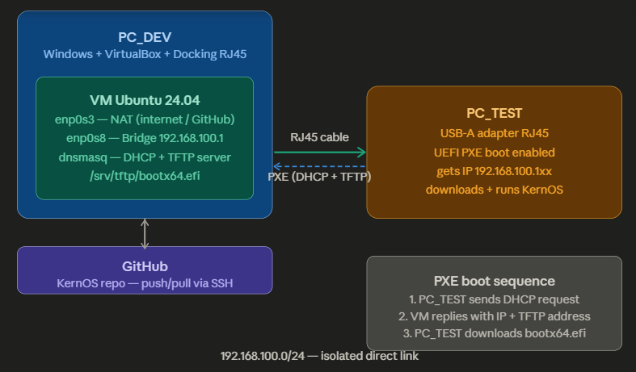

# KernOS — Boot Process & Real Hardware Testing

> This document describes the two methods used to test KernOS :
> emulation via QEMU during development, and real hardware testing via PXE boot.

---

## Table of Contents

1. [Overview](#overview)
2. [Method 1 — QEMU (development)](#method-1--qemu-development)
3. [Method 2 — PXE Boot (real hardware)](#method-2--pxe-boot-real-hardware)
4. [Lab Network Architecture](#lab-network-architecture)
5. [PXE Setup Guide](#pxe-setup-guide)
6. [Boot Sequence](#boot-sequence)
7. [Troubleshooting](#troubleshooting)

---

## Overview

KernOS is tested at two levels during development :

| Method | When to use | Speed | Fidelity |
|--------|------------|-------|---------|
| QEMU | Every code change | Instant | Good — emulated hardware |
| PXE boot | Milestone validation | ~30s | Perfect — real hardware |

QEMU is the primary development loop — `make run` compiles and boots in seconds.
PXE boot is used to validate that KernOS works on real physical hardware without
needing to flash a USB drive every time.

---

## Method 1 — QEMU (development)

QEMU is a full system emulator. It simulates a complete x86_64 PC including
CPU, RAM, disk, and a UEFI firmware (OVMF).

### How it works

```
make run
  └── cargo +nightly build       (compile bootloader + kernel)
  └── dd + mkfs.fat + mcopy      (build FAT32 disk image)
  └── qemu-system-x86_64         (boot the disk image)
        └── OVMF firmware        (UEFI environment)
              └── bootloader.efi (KernOS bootloader)
                    └── kernel   (KernOS kernel)
```

### Command

```bash
make run
```

### Exiting QEMU

```
Ctrl+A then X
```

### QEMU flags explained

| Flag | Purpose |
|------|---------|
| `-drive if=pflash,file=OVMF_CODE_4M.fd` | Load UEFI firmware |
| `-drive format=raw,file=axiom.img` | Attach the disk image |
| `-m 256M` | Give the VM 256 MB of RAM |
| `-nographic` | Redirect display to terminal (no GUI needed) |
| `-no-reboot` | Stop instead of reboot on crash |

---

## Method 2 — PXE Boot (real hardware)

PXE (Preboot eXecution Environment) allows a machine to boot over the network
instead of from a local disk. The development VM acts as a PXE server, and
PC_TEST boots KernOS directly from it over an ethernet cable.

This eliminates the need to flash a USB drive for every test iteration.

### Hardware used

| Device | Role | Connection |
|--------|------|-----------|
| PC_DEV | Development machine running the VM | Docking station with RJ45 port |
| VM Ubuntu 24.04 | PXE server (DHCP + TFTP) | Bridged on ethernet adapter |
| PC_TEST | Test machine, boots KernOS | USB-A to RJ45 adapter |
| RJ45 cable | Direct link between PC_DEV and PC_TEST | Connects docking to USB adapter |

---

## Lab Network Architecture



```
┌─────────────────────────────────┐
│ PC_DEV (Windows)                │
│  └── VirtualBox                 │
│       └── VM Ubuntu 24.04       │
│            ├── enp0s3 (NAT)     │──── Internet / GitHub
│            │   10.0.2.15        │
│            └── enp0s8 (Bridge)  │
│                192.168.100.1    │
└─────────────────────────────────┘
                │
                │ RJ45 cable (direct link)
                │ 192.168.100.0/24
                │
┌─────────────────────────────────┐
│ PC_TEST                         │
│  USB-A RJ45 adapter             │
│  gets IP : 192.168.100.1xx      │
│  boots KernOS via TFTP          │
└─────────────────────────────────┘
```

### Network addressing

| Host | Interface | IP Address | Role |
|------|-----------|-----------|------|
| VM | enp0s3 | 10.0.2.15 (DHCP) | Internet access, GitHub |
| VM | enp0s8 | 192.168.100.1 (static) | PXE server |
| PC_TEST | USB RJ45 | 192.168.100.100–200 (DHCP) | PXE client |

---

## PXE Setup Guide

This section documents the exact steps taken to set up the PXE server
on the development VM. Follow these steps to reproduce the environment.

### Step 1 — Configure VirtualBox network adapters

In VirtualBox settings for the VM :

- **Adapter 1** : NAT — provides internet access to the VM (Make a NAT rule to connect in remote SSH via your local computer holding the VM [Here PC_DEV])
- **Adapter 2** : Bridged Adapter — select the physical ethernet interface
  of PC_DEV (e.g. `Realtek USB FE Family Controller`)

### Step 2 — Assign a static IP to the bridge interface

```bash
# Temporary (lost on reboot)
sudo ip link set enp0s8 up
sudo ip addr add 192.168.100.1/24 dev enp0s8

# Permanent — create a netplan config
sudo nano /etc/netplan/99-pxe.yaml
```

Content of `/etc/netplan/99-pxe.yaml` :

```yaml
network:
  version: 2
  ethernets:
    enp0s8:
      dhcp4: false
      addresses:
        - 192.168.100.1/24
```

```bash
sudo netplan apply
```

### Step 3 — Install dnsmasq

dnsmasq handles both DHCP (assigns IP to PC_TEST) and
TFTP (serves the bootloader file over the network).

```bash
sudo apt install -y dnsmasq
```

### Step 4 — Configure dnsmasq

```bash
sudo nano /etc/dnsmasq.conf
```

Full configuration :

```conf
# Listen only on the direct link to PC_TEST.
# Never listen on enp0s3 (NAT) to avoid conflicts.
interface=enp0s8
bind-interfaces

# Disable DNS — we only need DHCP and TFTP for PXE.
# This avoids conflicts with systemd-resolved on port 53.
port=0

# DHCP range : PC_TEST will receive an IP in this range.
dhcp-range=192.168.100.100,192.168.100.200,12h

# Enable the built-in TFTP server.
enable-tftp
tftp-root=/srv/tftp

# PXE boot file : the UEFI firmware of PC_TEST will download this file.
# For UEFI x86_64, the standard filename is bootx64.efi.
dhcp-boot=bootx64.efi
```

### Step 5 — Create the TFTP root and copy the bootloader

```bash
sudo mkdir -p /srv/tftp

# Copy the compiled bootloader to the TFTP root
sudo cp ~/KernOS/target/esp/EFI/BOOT/BOOTX64.EFI /srv/tftp/bootx64.efi
sudo chmod 644 /srv/tftp/bootx64.efi
```

### Step 6 — Start and enable dnsmasq

```bash
sudo systemctl restart dnsmasq
sudo systemctl enable dnsmasq

# Verify it is running
sudo systemctl status dnsmasq
```

### Step 7 — Update the bootloader after each build

After every `make build`, the TFTP file must be refreshed :

```bash
sudo cp ~/KernOS/target/esp/EFI/BOOT/BOOTX64.EFI /srv/tftp/bootx64.efi
```

This step will be automated in the Makefile in a future iteration.

### Step 8 — Configure PC_TEST to boot via PXE

On PC_TEST, enter the UEFI firmware setup (usually F2, F12, or Del at power-on).

- Enable **Network Boot** or **PXE Boot**
- Set the boot order to prioritize the network adapter
- Save and reboot

PC_TEST will then :
1. Send a DHCP broadcast over the cable
2. Receive an IP address and the TFTP server address from the VM
3. Download `bootx64.efi` via TFTP
4. Execute the KernOS bootloader

---

## Boot Sequence

### Full PXE boot sequence

```
PC_TEST powers on
  └── UEFI firmware initializes
        └── PXE network boot selected
              └── DHCP request broadcast
                    └── VM dnsmasq responds
                          ├── assigns IP 192.168.100.1xx
                          └── points to TFTP server at 192.168.100.1
                                └── PC_TEST downloads bootx64.efi via TFTP
                                      └── UEFI executes bootx64.efi
                                            └── KernOS bootloader starts
                                                  ├── displays boot banner
                                                  ├── loads kernel.elf
                                                  ├── parses ELF segments
                                                  ├── retrieves memory map
                                                  ├── exits UEFI boot services
                                                  └── jumps to kernel_main()
```

### What you see on PC_TEST screen

```
============================================
  KernOS v0.1.0
  Bootloader starting...
============================================
[OK] Kernel loaded from disk
[OK] Kernel ELF segments loaded
[OK] Memory map retrieved
Exiting UEFI boot services...
```

---

## Troubleshooting

### enp0s8 stays DOWN after VM boot

```bash
sudo ip link set enp0s8 up
```

If it still fails, check VirtualBox adapter 2 is set to the correct
physical interface and that the RJ45 cable is plugged in on both ends.

### dnsmasq fails to start — "Address already in use"

`systemd-resolved` occupies port 53 by default on Ubuntu 24.04.
The fix is to add `port=0` to `/etc/dnsmasq.conf` so dnsmasq does not
try to act as a DNS server. Only DHCP and TFTP are needed for PXE.

```bash
# Verify what is using port 53
sudo ss -tulpn | grep ':53'

# Restart dnsmasq after fixing the config
sudo systemctl restart dnsmasq
```

### PC_TEST does not receive an IP

1. Verify the cable is connected on both ends and LEDs are lit
2. Check `sudo systemctl status dnsmasq` — must show `active (running)`
3. Watch dnsmasq logs in real time while PC_TEST boots :

```bash
sudo journalctl -fu dnsmasq
```

### PC_TEST downloads the file but hangs

The kernel stub currently loops forever — this is expected behavior
until Brick 1 (kernel bootstrap) is implemented.
If the bootloader banner appears on screen, everything is working correctly.